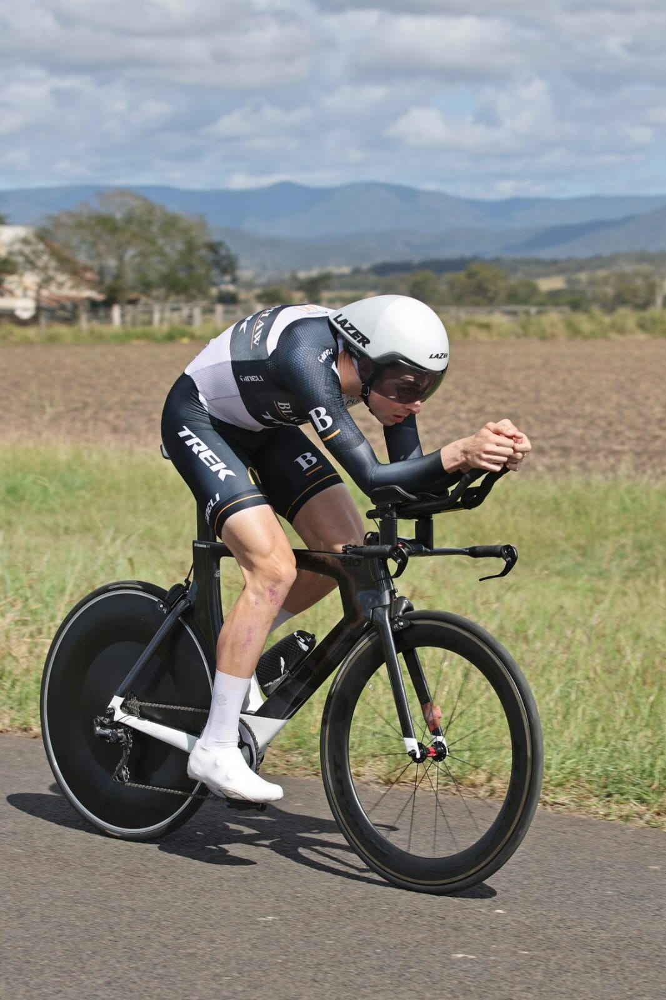
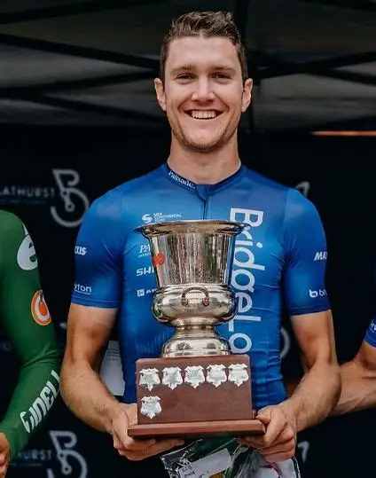

## About Cycling Performance Coaching
CPC was established to create a personalized coaching experience for keen athletes who wish to improve their performance. Each plan is adaptive based on you as an athlete.

We aim to help educate the athlete along the way, learning why and how the training methods are applied.

 

CPC is passionate about all forms of endurance exercise, and regardless of the level of competition will be happy to help you achieve your goal. From road cycling, gravel racing, to triathlon, we are here to help you improve.

## Meet Our Coaches

### Oli Stenning

::: {.about-right-image}

:::

Bachelor of Sport and Exercise Science & Postgraduate in Sports Data Analytics.
Studying a Master of Analytics.

Passionate about all forms of cycling and triathlon/multisport.

#### About Oli
Our head coach Oli Stenning started as a junior triathlete and wne onto earn a professional license. In 2020, Oli transitioned to competitive cycling, progressing to race at a continental level internationally. Some of his notable achievements include securing 2nd place at the Elite Men's Oceania Time Trial, a win in the China Pro Cycling League, 2nd at the Melbourne to Warrnambool, 3rd at the Grafton 2 Inverell, and achieving several podium finishes in both the National Road Series and Spanish races. 
At the end of 2024 Oli represented Australia at the Elite Gravel Worlds Championships over in Belgium.

Oli's academic background supports his athletic career in his coaching knowledge. He completed a Bachelor's degree in Sport and Exercise Science while actively racing, followed by postgraduate studies in Sports Data Analytics. This blend of practical experience and academic knowledge equips Oli with a unique perspective on athlete development and performance optimization.

Oli's coaching philosophy centers on helping individuals improve and achieve their goals through well-structured and meticulously scheduled training programs. He is dedicated to educating athletes throughout their journey, ensuring they understand the principles behind their training and are empowered to reach their full potential. Whether you're a seasoned athlete or just starting, Coach Oli is committed to guiding you towards success.

### Sam Hill

::: {.about-sam-image}

:::

#### About Sam

Sam Hill brings a wealth of experience to Cycling Performance Coaching, having competed at an elite level both in Australia and internationally. His racing highlights include a UCI stage victory at the Le Tour de Filipinas and podium finishes at Australia's iconic Grafton to Inverell Cycle Classic, one of the country's toughest one-day races. Throughout his career, Sam has raced across road, gravel and endurance events, giving him first-hand knowledge of the demands of high-performance cycling.

Away from racing, Sam is a qualified teacher with a Bachelor of Education. His educational background allows him to explain training principles in a clear, practical and supportive way, helping athletes understand not just what to do, but why they are doing it. By combining elite racing experience with evidence-based coaching and personalised support, Sam works with cyclists of all abilities to build confidence, improve performance and achieve their individual goals.

## Consistency and Motivation
Cycling Performance Coaching aims to inspire and motivate athletes so they may reach their maximum potential. The only thing stopping you from reaching your goal, no matter how large it may be, is your mindset and a coach who will mentor you every step of the way. When you're on board with CPC, you will never be motivated out of fear or guilt. CPC reinforces positive behaviors from our athletes and treats every failed session as a learning opportunity. Whilst our primary goal will be to improve your cycling performance, it is essential that you remain motivated and your passion for cycling is never stifled.

Don't hesitate to get in touch and inquire about one of our custom-made programs.

