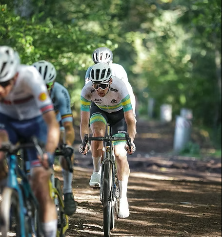
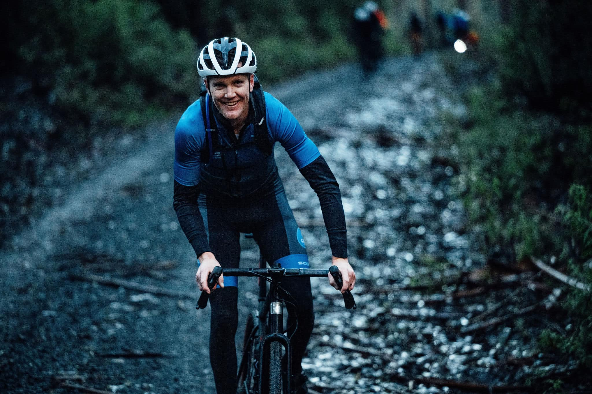

::: home-side-image

:::

::: {style="float:right; margin-right:-330px; margin-left:10px; margin-top:20px"}

:::

# Cycling Performance Coaching

Cycling Performance Coaching is dedicated to helping cyclists achieve their personal goals. Our coaches are experienced professionals who provide personalized training plans and offer the support and guidance you need to reach the next level.

We believe that everyone has the potential to reach their peak performance, and our mission is to help you do just that. Whether you’re a beginner or an experienced cyclist, we have the tools and resources to help you get there. Let us help you become the cyclist you’ve always wanted to be.

### Transform Your Riding with Cycling Performance Coaching

We provide online, daily programs tailored to your goals and your lifestyle (and much more). We are always taking on new athletes. We work with everyone and in a variety of disciplines, whether it be road, MTB, gravel, triathlon, track or Esports. If it involves peddaling a bike, or competing in a triathlon, we will help you to reach your goals and become the best version of yourself.

### Unlock Your Potential

Personalized coaching for road, gravel, MTB and triathlon athletes.

&nbsp;&nbsp;&nbsp;&nbsp;&nbsp;&nbsp;&nbsp;&nbsp;&nbsp;&nbsp;&nbsp;&nbsp;&nbsp;&nbsp;&nbsp;&nbsp;&nbsp;&nbsp;&nbsp;&nbsp;&nbsp; [Meet the Coaches](coaches.qmd){.btn-cpc-outline} &nbsp; &nbsp;&nbsp;&nbsp;&nbsp;&nbsp; [Start Coaching](contact.qmd){.btn-cpc}
