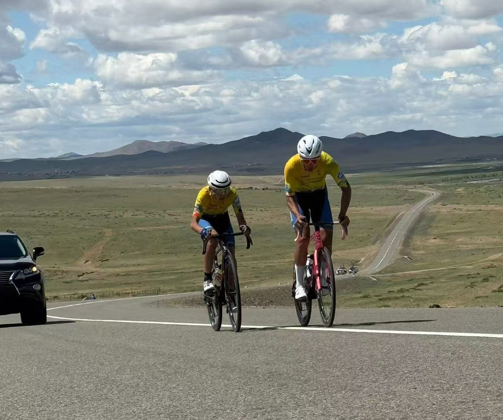
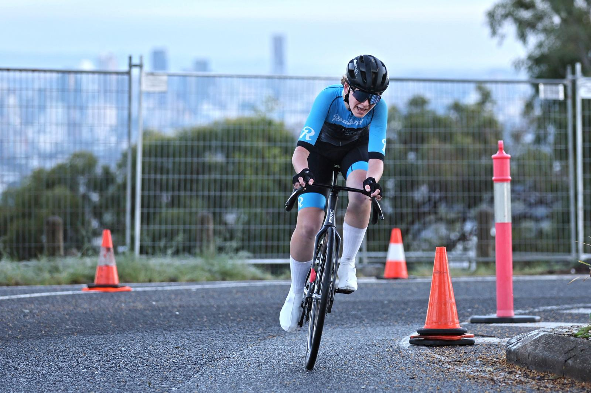

## Proven Results

::: {.testimonial}
::: {.testimonial-content}

### Cameron Fraser

"Oli is a coach who truly understands the needs of a performance-focused athlete. His expertise in balancing intensity with recovery was instrumental in my preparation for major events, including my stage win at the Tour de Entete in Indonesia. Oli has been the driving force behind my biggest cycling achievements to date and I am grateful for him!"

*Stage Winner – Tour de Entete 2025*

:::

::: {.testimonial-image}

:::
:::

---

::: {.testimonial}
::: {.testimonial-content}

### Davaajargal Altangerel

"It has been a pleasure to work with Oli at CPC. I liked the training was based well for my physical condition, and I started to see results within a month or starting the plan."

*Mongolian U23 National Road Race Champion 2026* 

*3rd Mongolian U23 Time Trial 2026*

:::

::: {.testimonial-image}

:::
:::

---

::: {.testimonial}
::: {.testimonial-content}

### Callum Maciver

"Working with Oli has been a great experience. I have appreciated the communication with regular check-ins and helpful feedback after my rides. The training has been personalized and adjusted to how I'm feeling, which has helped me have confidence in the plan and increase my FTP by 30w without having to increase the training load."

*3rd Overall Australian U19 Road Series 2026* 

*2nd GC Balmoral Junior Tour National Series 2026*

:::

:::  {.testimonial-image}

:::
:::

